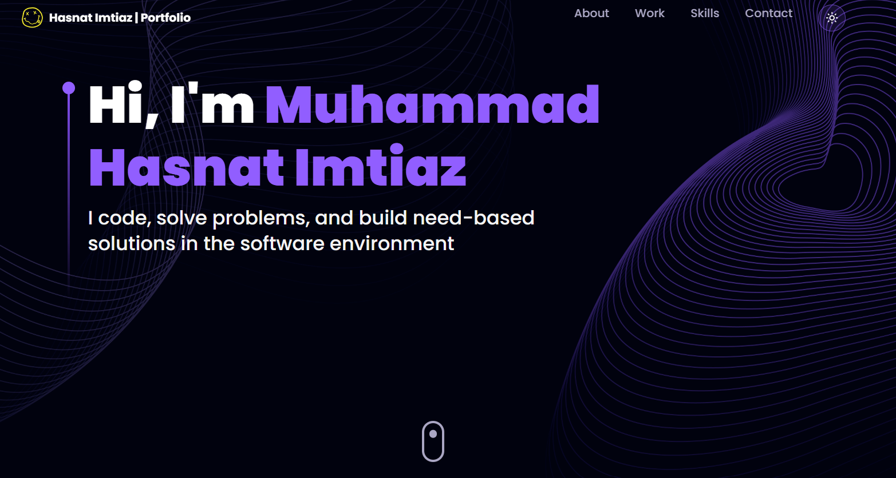
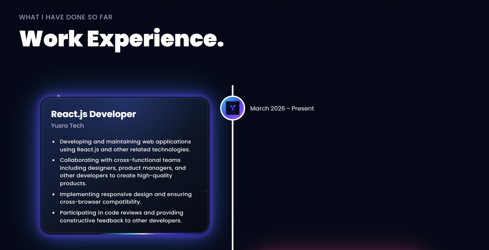
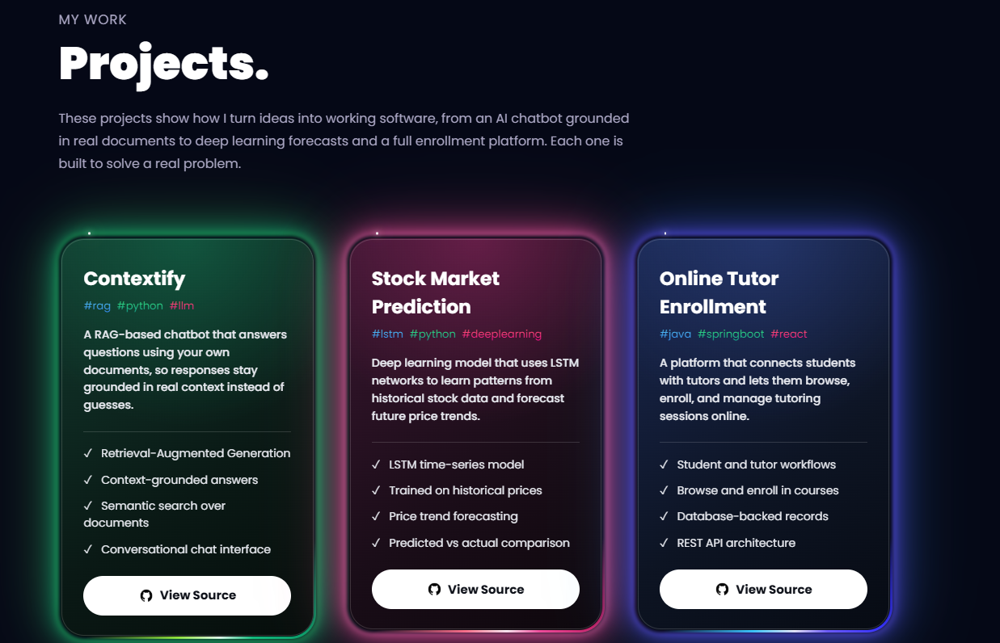

# Hasnat's Portfolio

A modern portfolio website built with React, TypeScript, Tailwind CSS, and Three.js. It is designed to present my work, experience, and skills in a clean and interactive way.

## Preview

### Home

<div align="center">
  
</div>

### Experience

<div align="center">
  
</div>

### Projects

<div align="center">
  
</div>

## Tech Stack

- React
- TypeScript
- Vite
- Tailwind CSS
- Framer Motion
- Three.js
- EmailJS

## Run Locally

```bash
npm install
npm run dev
```

## View Live

Waiting for update. I will update it later.

## Contact

Open the website and use the contact section to connect.
